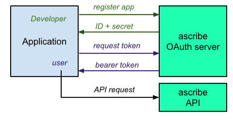

# REST-main
Version: 0.1

Main RESTful API for ascribe ownership web service. https://www.ascribe.io

## Table of Contents

- [API Documentation](#api-documentation)
    - [Overview](#overview)
    - [Authorization Flow](#authorization-flow)
    - [Register your Application or Marketplace](#register-your-application-or-marketplace)
    - [Request Access Token](#request-access-token)
- [Methods](#methods)
    - [Pieces](#pieces)
    - [Users](#users)
    - [Jobs](#jobs)

## API Documentation

### Overview
Integration has these actions:
1. Register your app/marketplace and request an access token. This is a one time action.
2. Register a piece.
3. Check the status of a piece.

### Authorization Flow
Let's call the marketplace Makx.

As authentication is used to connect transfer data between Makx and ascribe, we
use an encrypted connection (HTTPS).

Ascribe authorizes applications via tokens. Each token is an alphanumeric that
encodes the following information:
- The ID of the application that was granted access.
- The ID of the user who granted access to personal data.
- A set of actions available to the application.



### Register your Application or Marketplace
The developer (e.g. admin@makx.com) should have an [ascribe account](https://www.ascribe.io), 
login and go to settings>API settings to register
the application or marketplace with following fields:
- Name: `name of the marketplace`
- Client Type: `confidential`
- Authorization Grant Type: `Resource owner password-based`

The provided `client_id` and `client_secret` will now allow users of makx to
request an access token.

### Request Access Token
Once the application is registered and a `client_id` and `client_secret` are
available, a user can request a token, provided that he has an ascribe account.

#### HTTP Request
`POST https://www.ascribe.io/o/token/`

#### HTTP Headers 
`Authorization: Basic <client_id>:<client_secret>`

#### Arguments
Parameter | Description
----------|------------
grant_type | TODO
username | username of Makx
password | password of Makx

#### Example Request
```shell
curl -X POST http://localhost:8000/o/token/ \
-u 'AWp2Nl180u90DlIBRgZuysooDc2vBPNZOY!kJnKJ:E!NUgsjZAak.7@xTSkA:K1PA!y8ieFRw;;e?JqFj0cHL1e._L59Y7RmXif1;779h5jzVIqAbFN!Kl5RQfeZp6;iNGz-L916oyLxnkj=aVrVA@M4CBBy62q0Kd=YSgLnj' \
-d grant_type=password \
-d username=admin@makx.com \
-d password=mypassword \
-d scope='read write' 
```

#### Example Response
```json
{
    "access_token": "2GJT0yFOnHYKtp9sgNak4GURL9jpKD",
    "expires_in": 31536000,
    "refresh_token": "zG3DPnOUhjPy1sIo8DkSp43C0SH9f1",
    "scope": "read write",
    "token_type": "Bearer"
}
```

## Methods

### Pieces

#### List all pieces

##### Arguments

##### Example Request

##### Example Response

#### Retrieve a piece

##### Arguments

##### Example Request

##### Example Response

#### Create a piece

##### Arguments

##### Example Request

##### Example Response


### Users

#### List all users

##### Arguments

##### Example Request

##### Example Response

#### Retrieve a user

##### Arguments

##### Example Request

##### Example Response

#### Create a user

##### Arguments

##### Example Request

##### Example Response


### Jobs

#### List all jobs

##### Arguments

##### Example Request

##### Example Response


#### Retrieve a job

##### Arguments

##### Example Request

##### Example Response


